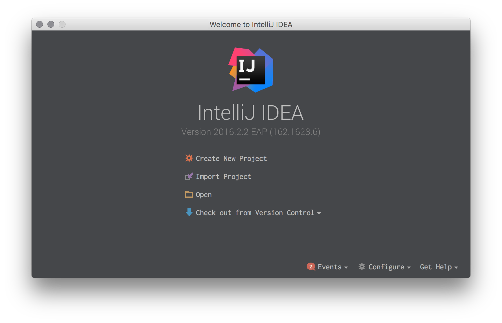
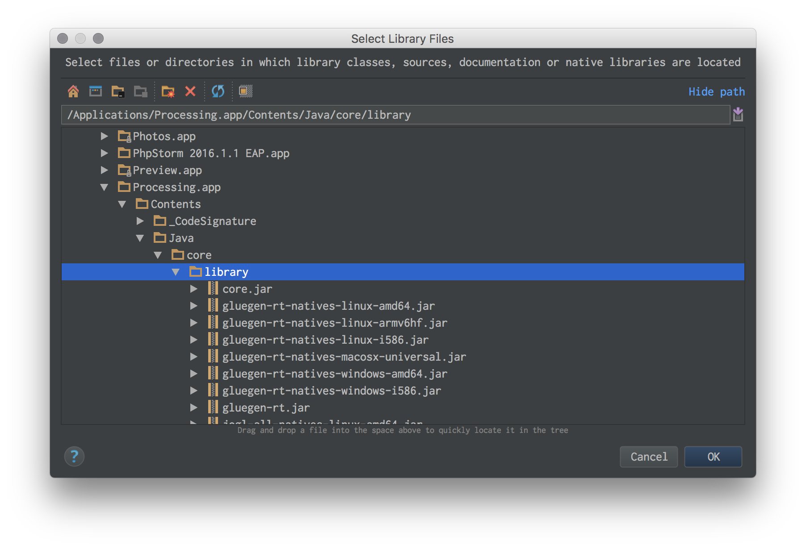
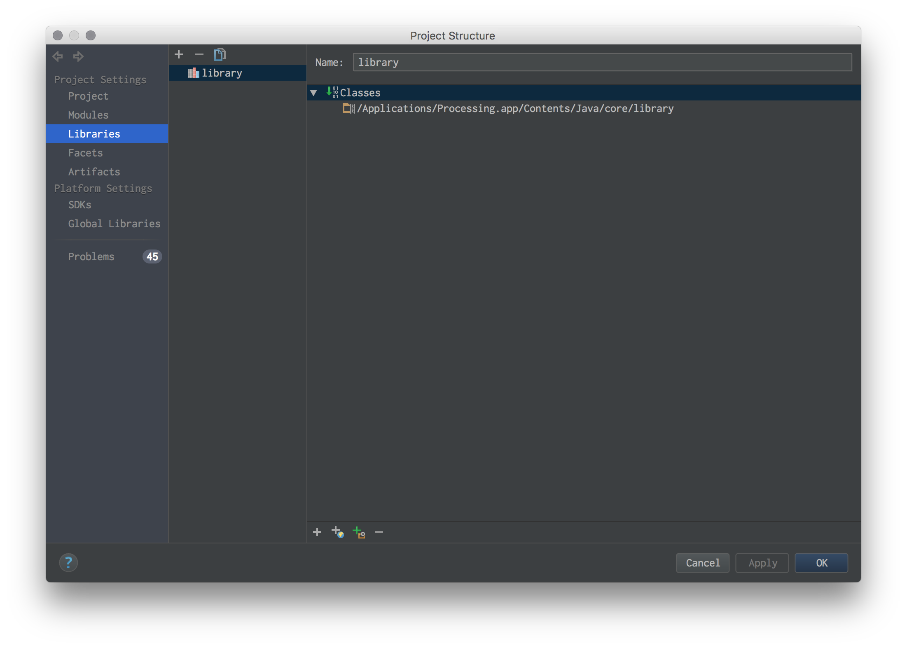

#IntelliJ_Processing_Template


1. [Create New Project] 
	
2. [Java]
3. empty next...
4. project generated
5. Project  Setting [ command + ; ] 
6. Libraries tab select and [+] push
7. add [ /Applications/Processing.app/Contents/Java/core/library/ ] 
	
9.  [ Debug Configurations ] select and [+] push
	
10. [ Application ]
11. [ Main class ] -> project class name
12. [ Use classpath of modules ] Processing


```

import processing.core.*;

public class {{ClassName}} extends PApplet {

    public static void main(String args[]) {
        PApplet.main("{{ClassName}}");
    }
    
    public void settings() {
        size(displayWidth, displayHeight);
    }

    public void setup() {
    	// Processing setup() code
    	// size() method -> settings
    }

    public void draw() {
    	// Processing draw() code
    }
}

```